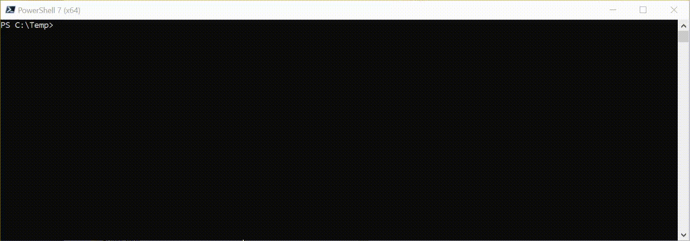

# Dynamic Template Parameters

By utilising the PowerShell Dynamic Parameter system, it is possible to turn the parameters in the `Parameters` section of a CloudFormation template into command line arguments for the PSCloudFormation cmdlets that take a template (`New-PSCFNStack`, `Update-PSCFNStack` and `Reset-PSCFNStack`). This makes it *much* easier to pass in parameter values to the stack than with either the AWS.Tools cmdlets (where you have to give it an array of hashes), or the CLI (where you have to supply a list of key/value pairs.

With dynamic parameters you get command line completion for the names of parameters in the template, plus value completion for parameters with `AllowedValues`. All parameters are also type-checked *before* sending to AWS against `AllowedPattern` where specified, and also against `Type` where specified i.e. it won't let you pass a string when a number is expected. This includes validating against AWS specific types like `AWS::EC2::VPC::Id` etc.

Where a template parameter has no default, the PowerShell `Mandatory` attribute is applied to the generated parameter so PowerShell will prompt for any required parameters not present on the command line.

## In Action

Consider the following template

```yaml
AWSTemplateFormatVersion: '2010-09-09'
Description: Demo Stack
Parameters:
  SSMParamValue:
    Description: Value for ssm parameter
    Type: String
    AllowedValues:
    - Hello
    - World
Resources:
  SSMParameter:
    Type: AWS::SSM::Parameter
    Properties:
        Type: String
        Value: !Ref SSMParamValue
```

### Using Autocompletion

Note in this example how both the parameter name and the allowed values are autocompleted


### Passing an Invalid Value

Here a value that is not one of the valid values is passed to the parameter. It is caught before the template is submitted to CloudFormation



### Omitting a parameter with no default

If a required parameter is omitted, this is caught. Entering `!?` as directed for help prints the `Description` of the parameter from the template if present.


