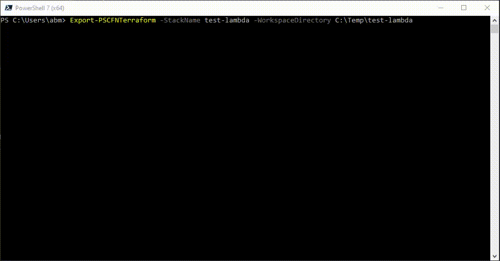

# Example - Lambda Stack

This example shows a serverless lambda with embedded python script and an Event Bridge rule to trigger it.

Demonstrates the following
* How a serverless resource is expanded to all implied resources.
* How inline lambda code is exported to Terraform.
* Dependency resolution within IAM policies.

## CloudFormation

CloudFormation to build the stack is [here](./cloudformation.md).

The stack was deployed with a stack name of `test-lambda`.

## Import run

This is the command to export `test-lambda` to Terraform in action...

A few points to note here

* An extra provider [ArthurHlt/Zipper](https://registry.terraform.io/providers/ArthurHlt/zipper/latest) is included to manage the extracted lambda code.
* There are five imported resources, when the CloudFormation only contains two resources. This is because the serverless lambda declaration implies creation of a role, an event resource and a lambda permission to permit Event Bridge to invoke the lambda.
* When the function is imported (Resource 1/5) the inline python code is extracted and written to a file. Exported lambda code is written to directory `./lambda`, with a further subdirectory of the lambda's resource name and within there, an `index` file with file extension as implied by the function's `Runtime` property.
* In the plan stage at the end, we see some changes
    * A new resource. This creates the zip package of the extracted python code for deployment.
    * A change to the lambda function. This is because we have injected the [filename](https://registry.terraform.io/providers/hashicorp/aws/latest/docs/resources/lambda_function#filename) and [source_code_hash](https://registry.terraform.io/providers/hashicorp/aws/latest/docs/resources/lambda_function#source_code_hash) arguments to refer to the zip package, by way of the additional provider.
    * A change to the bucket - This always happens with S3 buckets, but is a non-destructive change. It wants to add the default `private` ACL type, as this is `null` in the state file after `terraform import`.
* We are also warned about the lambda. It is entirely possible the the *actual* code of the lambda is newer that what was deployed originally by the CloudFormation. A newer version could have been uploaded from the Lambda console, or via Lambda APIs as might happen in a CI/CD system. Without refreshing the content of the extracted script file with the current version, application of the Terraform configuration would overwrite the current version of the lambda code.

## Generated outputs

* [main.tf](./hcl.md)

